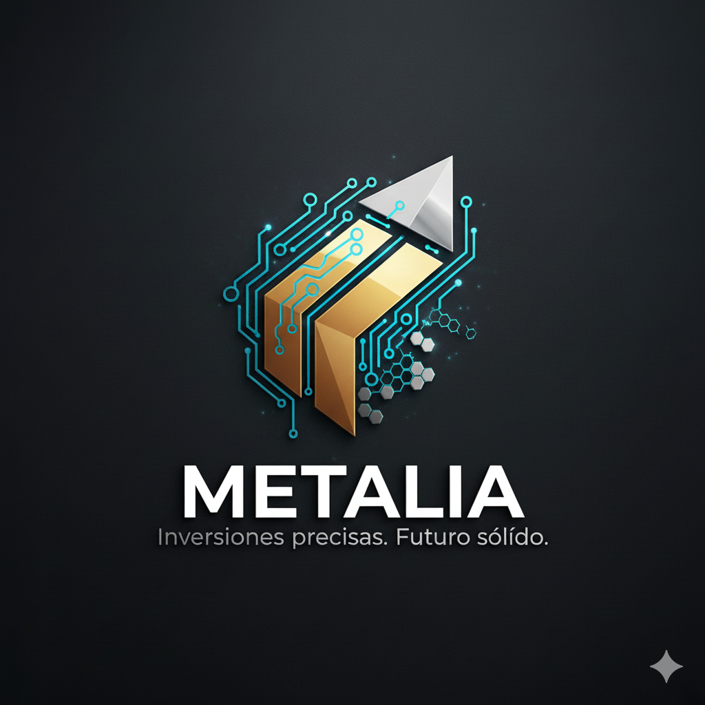

# Nuestra Identidad: Precisión, Integridad, Visión

METALIA fue fundada por un equipo de analistas veteranos y gestores de cartera con una visión compartida: crear una consultora de inversión de élite con un enfoque láser en el sector de los metales.

### Misión

Nuestra misión es democratizar el acceso a estrategias de inversión de alto rendimiento en metales preciosos e industriales, tradicionalmente reservadas para grandes fondos institucionales. Protegemos y hacemos crecer el capital de nuestros clientes con una gestión de riesgos rigurosa y un profundo conocimiento del ciclo de los metales.

### Nuestro Equipo

Creemos en el talento. Nuestro equipo está compuesto por geólogos, economistas y expertos en finanzas cuantitativas que colaboran para ofrecer una visión de 360 grados del mercado.